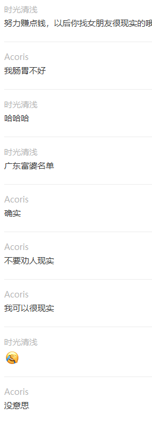
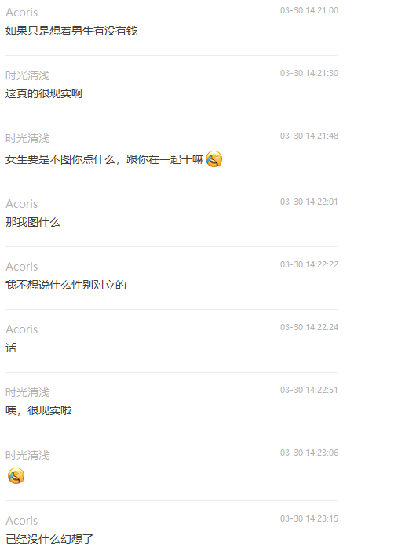
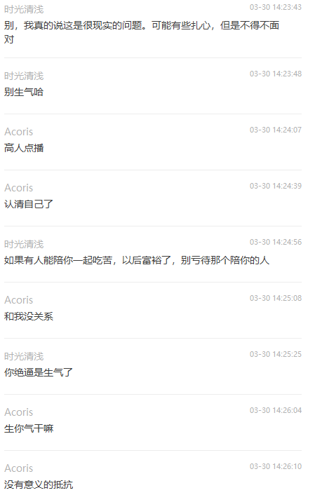
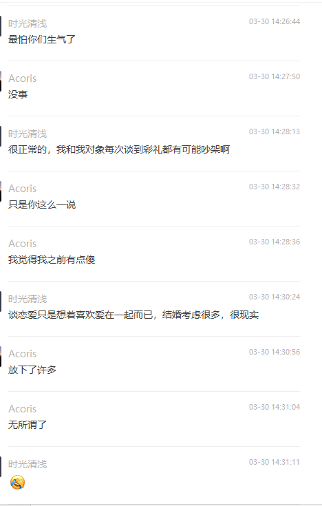

# 2021年3月15日

今天我同事吐槽了一下一个妹子，那个妹子我也认识，她说妹子硬拉着他去喝酒。然后我就酸了，没错我酸了，我在想为什么就没有邀请我呢？

## 为什么不是我？

这应该是大家会陷入的最大的情绪，为什么不是我？其实我对妹子并没有太多的执着，也知道她不是我的菜，我也不是她的菜，但是人的本能还是会在意自己为什么不受欢迎这件事情的！

* 希望被期待
* 希望被记忆
* 希望被邀请
* 希望被关注
* 希望受欢迎

## 是我哪里不够好嘛？

这可能是大家会陷入的第二种情绪，为什么TA看不上我？难道是我不够好嘛？

### #1 期待被关注的焦虑

因为迫切的希望能够被别人关注，最终这种焦虑会让客体进入自我消极状态，甚至再受到一点同类型的打击直接进入了自我消极的死循环，从此在自己的内心里埋下一个：我不是，我不行，我很差劲，我就是衰的死循环。

### #2 自卑在作祟

因为自身的缘故，可能客体会联想到自己的卑微过去，进而得出自己是一个屑之类的想法。然后又是一个消极的死循环。

### #3 

# 2021年3月25日

今天和朋友讨论了一下王者荣耀和LOL之间的差异性问题，说实话一开始我倒是带着偏见去的，纯粹是硬找茬，细节有待补充，但是随着我的一踩一捧的行为慢慢变得无趣之后，我就发现一个很有趣的问题。

## #1 群体对立并不是因为无知，而是多种因素造成的

### #1 傲慢

### #2 封闭

### #3 缺少包容

# 2021年3月30日

关于戾气、安慰、

## 安慰

### 喜欢听慢慢来的人

他们不喜欢与人分担自己的烦恼，他们会觉得把自己烦恼说给他人，他人又帮不上什么忙，与其让他人烦心不如自己慢慢消化，只需要为他们加油打气就好了。

### 不喜欢听慢慢来的人

他们更希望得到帮助，而不是听别人的加油打气。

